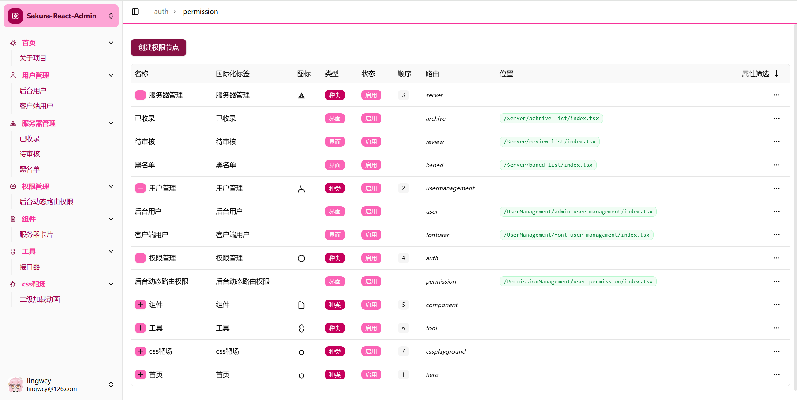
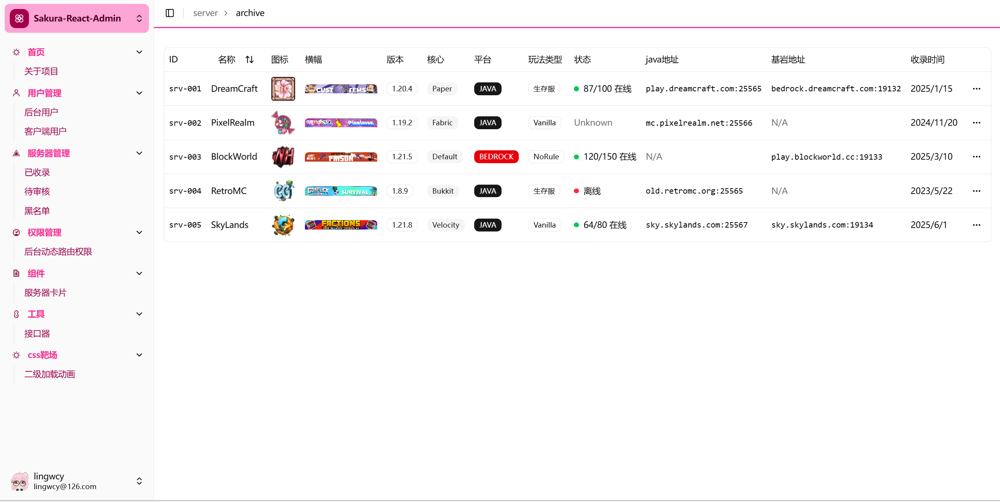
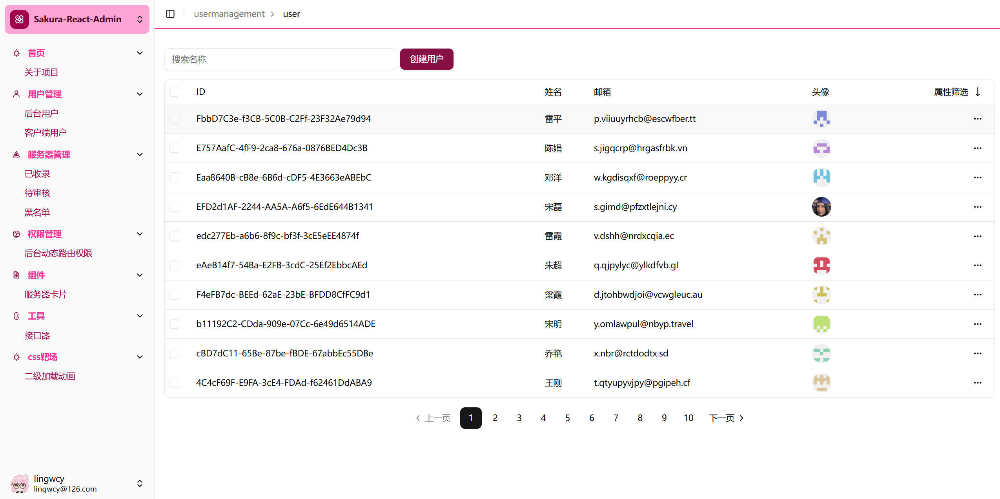

# Sakura React Admin

下一代通用后台管理系统.


  




## 🚀 Getting Started

### Prerequisites
- Node.js 18+ 
- npm

### Installation

```bash
# Clone the repository
git clone <repository-url>
cd react-jike

# Install dependencies
npm install

# Start development server
npm run dev

# Build for production
npm run build
```
